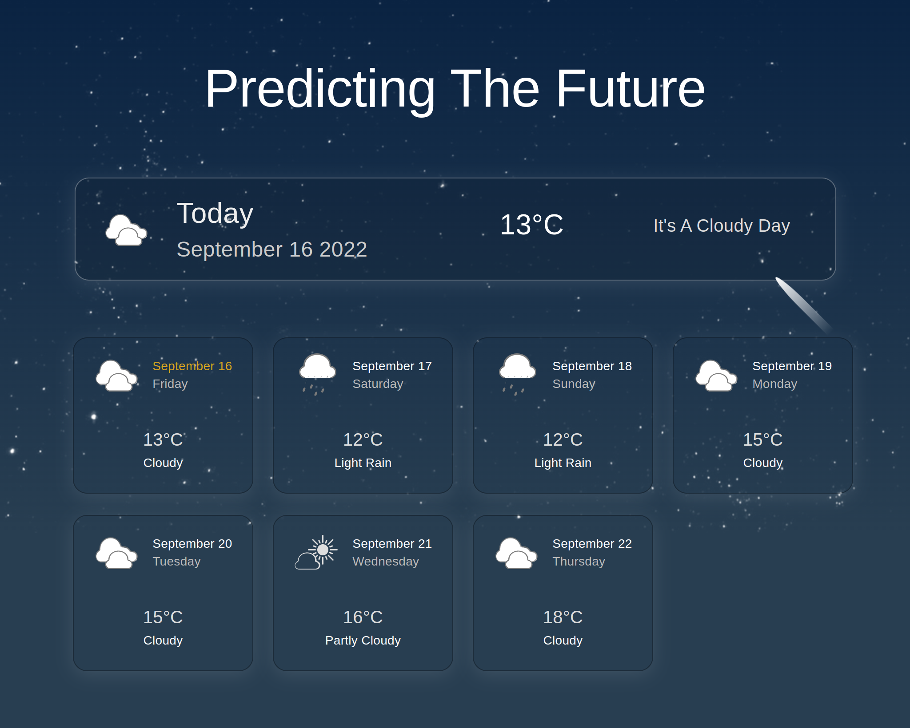
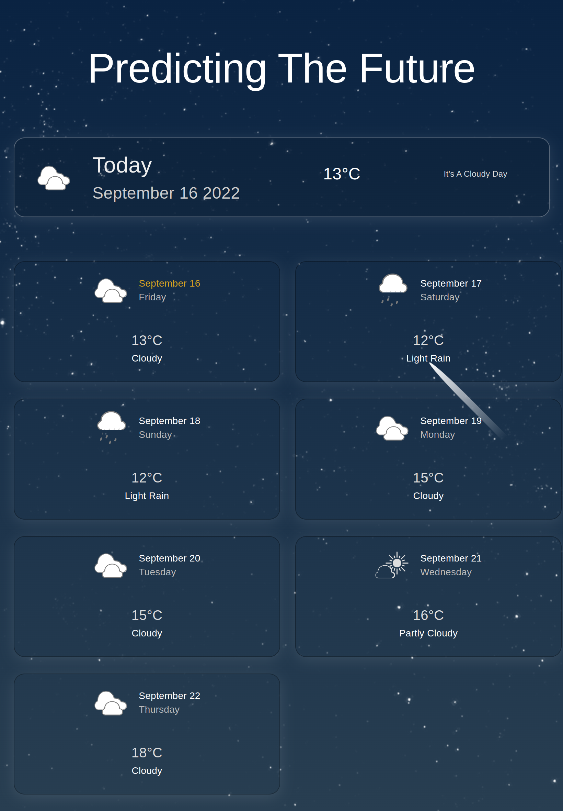
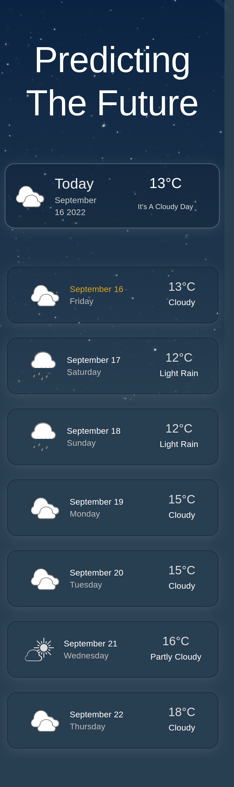

# Weather App

## Table of Contents

- [About](#about)
- [Features and Stack](#features-and-stack)
- [Screenshots](#screenshots)
- [Getting Started](#getting-started)
- [Future Work](#challenges)
- [Create React App](#bootstrapped-with-create-react-app)

## About

**Weather App** is a mobile friendly website showing the weather forcast for next seven days.

## Features and Stack

### Features

- fully responsive with support for mobile, tablet and desktop device to increase traffic.
- product cart with animation to increase user interaction and retention.
- used SVG icons, which are lightweight and scalable that looks great on high-density displays. 
- used geolocation to access current location from browser with users permission.
- cached in localstorage to reduce network traffic.
- refrain from fetching data if cached data is less than 3 days old to optimize performance and minimize HTTP requests.
- react useEffect hook and axios to consume external APIs.
- end-end-tested with cypress.
- documented for code maintainability.
- fully automated CI / CD pipeline implemented with github and github actions.
- deployed and hosted in firebase.

### Stack

- React
- typescript
- Material UI
- localstorage
- geolocation
- Axios
- cypress
- firebase
- github
- github actions

## Screenshots

- Landing Page (desktop view)



- Landing Page (tablet view)



- Landing Page (mobile view)




## Getting started

Below you'll find the instructions for setting up the project locally

### Clone repo and install dependencies

```bash
# Clone the repo
gh repo clone neuralchemist/weather-app

# Install dependencies
cd weather-app
npm install
```

### Add env variables

Create `.env` file, and add weather api keys

### Start the app

```bash
# Start development server
npm start
```

The app should be running at: [http://localhost:3000](http://localhost:3000/)

## Future Work

- create an account using email and password
- authenticate using Facebook, GitHub or Google
- add search bar to search different cities.

These are some of the features I want to implement or reuse in this projects from some of my other projects.

### Known Issues
- can't access user location from mobile device

## Bootstrapped with Create React App

This project was bootstrapped with [Create React App](https://github.com/facebook/create-react-app).

For the detailed description of available scripts see [CRA Documentation](https://create-react-app.dev/docs/available-scripts)
